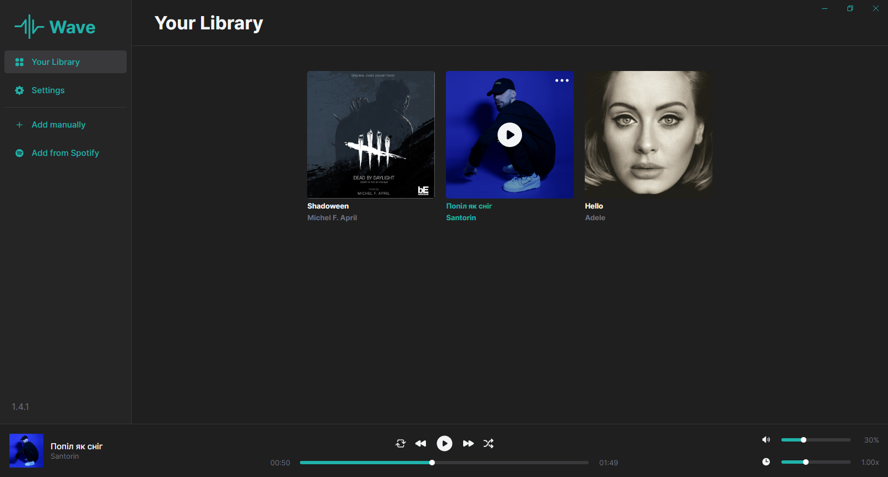
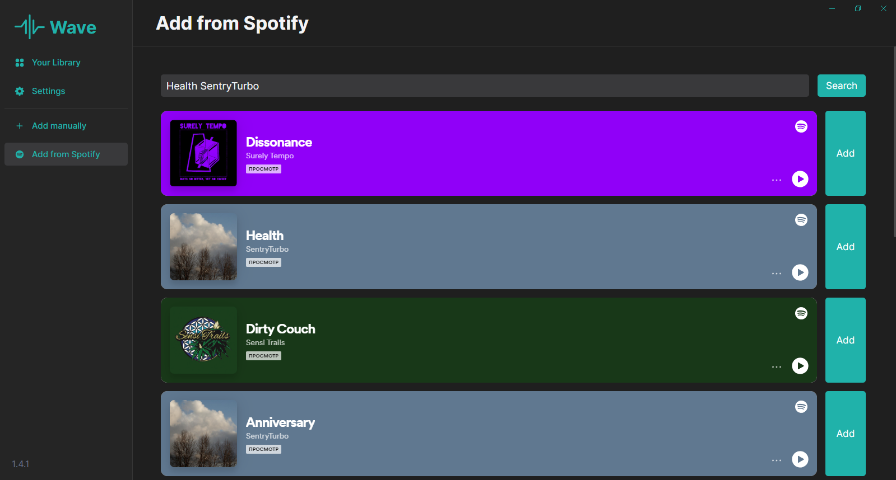

# Wave

- On Frontend **(TypeScript)**
  - [Vue](https://vuejs.org)
  - [Vite](https://vitejs.dev)
  - [Electron](https://www.electronjs.org)
  - [electron-updater](https://www.electronjs.org/docs/latest/tutorial/update)
  - [electron-builder](https://www.electron.build)
  - [Axios](https://axios-http.com)
  - [Pinia](https://pinia.vuejs.org)
  - [Vue Router](https://router.vuejs.org)

# 

# 
